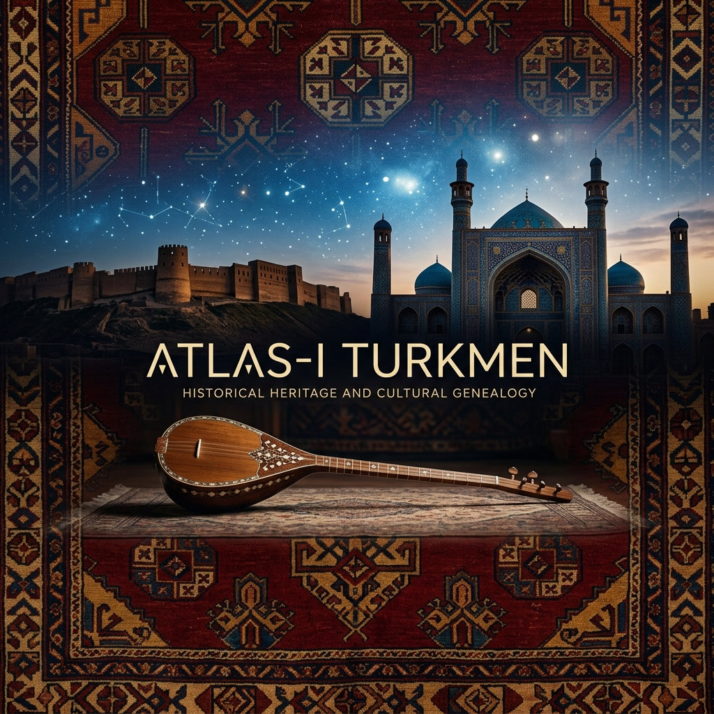

# Atlas-i Turkmen: Dijital Medeniyet Külliyatı

## 🏛️ Medeniyet Manifestosu: "Gönüller Bir Olsa..."

**Atlas-i Turkmen**, Mezopotamya'nın bereketli hilalinden Horasan'ın mistik bozkırlarına, Türkmensahra'nın rüzgarlı düzlüklerinden Kerkük'ün kadim kalesine kadar uzanan geniş bir sahada, Türkmen (Oğuz) varlığının ontolojik, kültürel ve tarihsel kodlarını korumayı amaçlayan bir **Dijital Medeniyet Arşivi**'dir.

Bu platform; sadece geçmişi yad etmek değil, Türkmen ruhunun (Mahtumkulu'nun tabiriyle "Gönüllerin birliği") modern dünyada yeniden yorumlanması ve gelecek kuşaklara bir "kültürel anayasa" olarak aktarılması için kurgulanmıştır. Kelamın, sazın ve halının diliyle yükselen bu medeniyet, parçalanmış coğrafyaların üstünde tek bir ruh olarak yükselir.

---

## 📜 Sözün Sultanları: Türkmen Edebiyatı'nın Zirveleri

Türkmen medeniyeti, her şeyden önce bir "kelam medeniyeti"dir. Söz, burada sadece bir iletişim aracı değil; bir mühür, bir dua ve bir kılıçtır.

### 🖋️ Mahtumkulu Firaki: Ruhun Sesi
Türkmen birliğinin manevi mimarı Mahtumkulu, bozkırın felsefesini şu dizelerle ölümsüzleştirmiştir:

> *"Ceyhun bile Hazar’ın arası yoldu, / Çöl üstünden eser yeli Türkmen’in; / Güller goncası, kara gözüm karası, / Kara dağdan iner seli Türkmen’in."*
>
> *"Hor bakma bu toprak deyip geçme sen, / Altında yatan var kulu Türkmen’in. / Gönüller, yürekler bir olup çıksa, / Toprak sarsılır, düşman kaçar Türkmen’den."*

### 🖋️ Nesimi: Hakikat Yolu
Vahdet-i Vücud düşüncesinin en gür sesi olan Seyyid Nesimi, Türkmen irfanının sarsılmaz direğidir:

> *"Bende sığar iki cihan, ben bu cihana sığmazam, / Cevher-i lâmekan benim, kevnü mekâna sığmazam."*

### 🖋️ Fuzuli: Aşkın ve Hüznün Şairi
Bağdat'tan Kerkük'e uzanan Türkmen ruhunun hüzünlü sesi:

> *"Bende Mecnun'dan füzun aşıklık istidadı var, / Aşık-ı sadık benem, Mecnun'un ancak adı var."*

---

## ✨ Hikmetler ve Kelam (Quotes)

Türkmen bilgeliğinin satır aralarına gizlenmiş, zamana meydan okuyan düsturları:

- **"Adam odur, her işten bir ibret ala."** — *Anonim Türkmen Hikmeti*
- **"Dil, kalbin aynasıdır; söz ise ruhun libası."** — *Mahtumkulu Firaki*
- **"Atı olanın muradı var, Dutar'ı olanın muradı var."** — *Bozkır Atasözü*
- **"Bir elin nesi var, iki elin sesi var; birliğin ise fethi var."** — *Tarihsel Düstur*

---

## 📂 Arşiv Yapısı ve Navigasyon

Külliyat, dört temel sütun üzerine inşa edilmiştir. Her bir sütun, Türkmen kimliğinin ayrılmaz bir parçasıdır:

### 🖋️ [Edebiyat ve Dil Bilimi](Edebiyat-Dil/)
Türkmen dilinin estetik zirveleri ve sözlü geleneğin yazılı hafızası.
- [Mahtumkulu Firaki: Türkmen Ruhu'nun Ontolojik Mimarı](Edebiyat-Dil/Mahtumkulu_Firaki.md)
- **Klasik Şiir Seçkisi:** Nesimi, Fuzuli ve Şahriyar'ın Türkmen/Oğuz eksenindeki izleri.
- **Horyatlar ve Maniler:** Kerkük ve Erbil'in yanık sesleri.

### 🎶 [Müzik ve Ses Arşivi](Muzik-Folklor/)
İki telin (Dutar) ve yanık seslerin (Horyat) felsefi derinliği.
- [Dutar ve Bahşı Geleneği: Bozkırın Tınısal Hafızası](Muzik-Folklor/Dutar_ve_Bahsi_Gelenegi.md)
- **Kerkük Makam Ekolü:** Baği, Mukalif ve Nevruz makamlarının teknik analizi.
- **Baxşı (Bahşı) Yolları:** Türkmensahra'dan Horasan'a uzanan ozanlık geleneği.

### 🎨 [Maddi Kültür ve Sanat](Sanat-Zanaat/)
İlmek ilmek işlenen tarih ve taşa kazınan mühürler.
- [Türkmen Halısı ve Tamga Sembolizmi: Dokunmuş Tarih](Sanat-Zanaat/Hali_ve_Tamga_Sembolizmi.md)
- **Mimari Miras:** Erbil Kalesi, Tebriz Gök Mescid ve Selçuklu kümbetlerinin estetik dili.
- **Geleneksel Kıyafetler:** Gümüş takılar ve "Kırmızı Köynek" sembolizmi.

### 🗺️ [Tarih ve Sosyoloji](Tarih-Sosyoloji/)
Oğuzların göç yolları, sosyal dokusu ve demografik atlası.
- [Oğuz Göç Atlası: Mezopotamya ve İran Hattında Türkmen Demografisi](Tarih-Sosyoloji/Oguz_Goc_Atlasi.md)
- **Aşiret Yapıları:** Teke, Yomut, Ersarı, Salur ve Bayat boylarının sosyolojik analizi.
- **Geleneksel Mutfak:** Türkmen pilavından (Çekdirme) bozkır ekmeğine (Çörek) bir gastronomi tarihi.

---

## 🎯 Vizyonumuz: Monolitik Bir Gelecek

"Dili bir, özü bir, sözü bir" bir gelecek için; parçalanmış coğrafyalardaki Türkmen mirasını tek bir dijital monolith altında birleştiriyoruz. **Atlas-i Turkmen**, bir müze değil, yaşayan bir hafıza odasıdır. 

Sözün bittiği yerde saz başlar; sazın sustuğu yerde halı konuşur. Biz, bu sessiz konuşmaları dünyanın her yerinden duyulur kılmak için buradayız.

---

## 🤝 Katkı Sağlama

Bu külliyat, kolektif bir iradenin eseridir. Akademik çalışmalarınızı, saha araştırmalarınızı veya aile arşivlerinizdeki belgeleri dijitalleştirerek bu hafızaya katkıda bulunabilirsiniz.

1. Depoyu **Fork**'layın.
2. Yeni çalışmanızı ilgili dizine ekleyin (Akademik format ve kaynakça zorunluluğu vardır).
3. **Pull Request** göndererek külliyatın genişlemesine ortak olun.

---

> *"Dili bir, dili bir, özü bir bir dünya için; Atlas-i Turkmen ile geçmişin izini, geleceğin ufuna taşıyoruz."*

---

## ⚖️ Lisans

Bu arşivdeki içerikler, kültürel bir mirasın korunması adına kamu yararına sunulmuştur. Alıntılarda **Atlas-i Turkmen** projesine atıfta bulunulması akademik bir gerekliliktir.

© 2026 | Atlas-i Turkmen Projesi