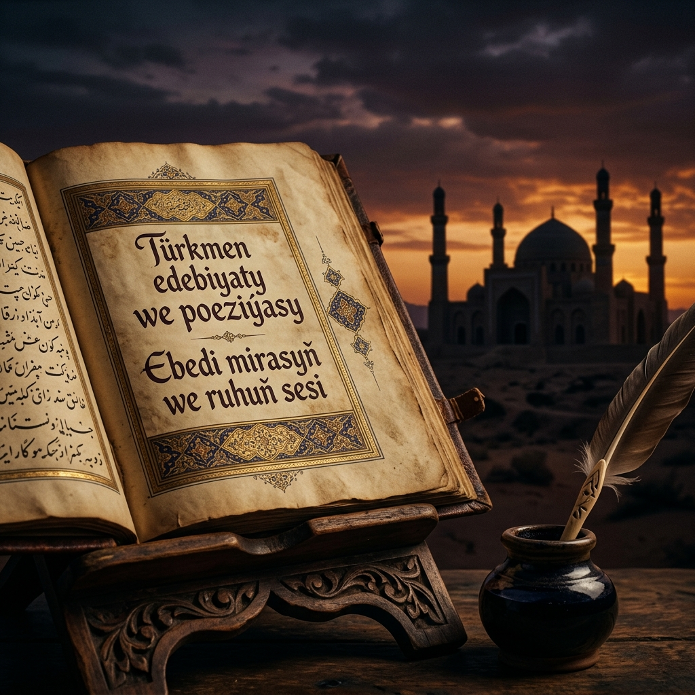
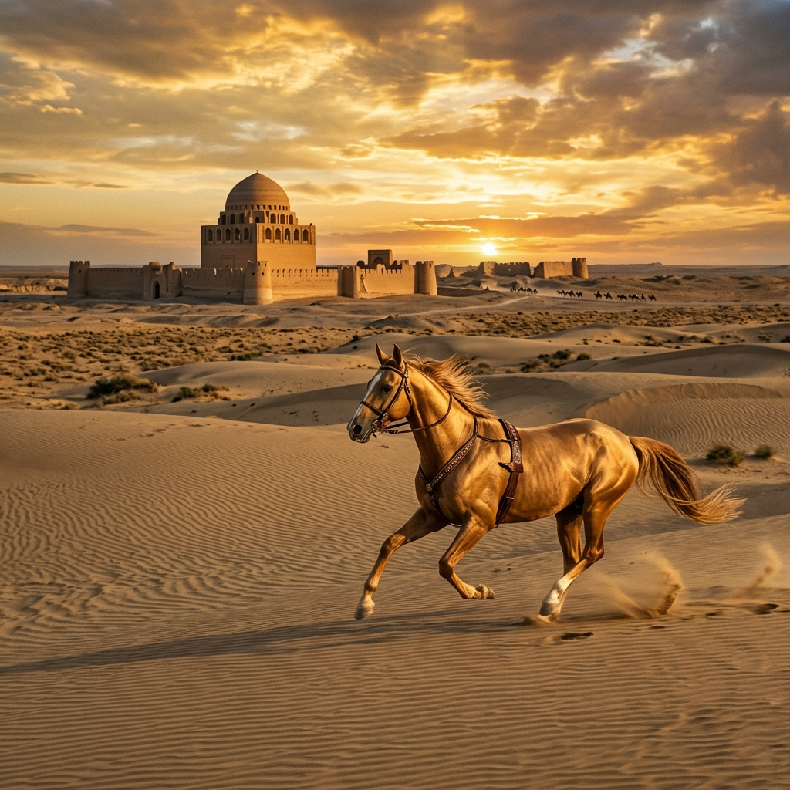
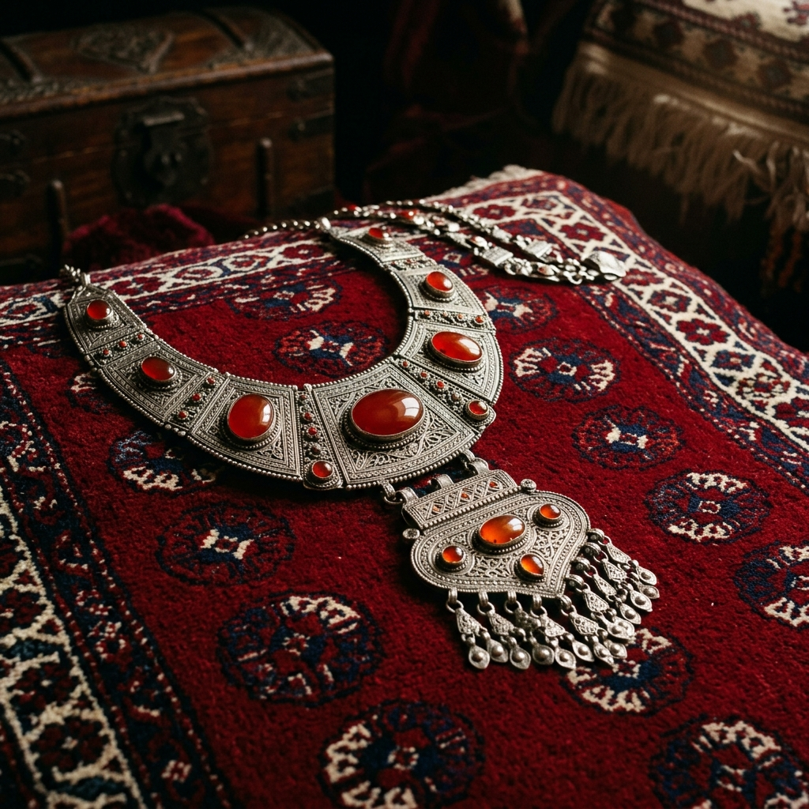

# Atlas-i Turkmen: Dijital Medeniyet Külliyatı

## 🏛️ Medeniyet Manifestosu: "Gönüller Bir Olsa..."

**Atlas-i Turkmen**, Mezopotamya'nın bereketli hilalinden Horasan'ın mistik bozkırlarına, Türkmensahra'nın rüzgarlı düzlüklerinden Kerkük'ün kadim kalesine kadar uzanan devasa bir sahada, Türkmen (Oğuz) varlığının ontolojik, kültürel ve tarihsel kodlarını korumayı amaçlayan bir **Dijital Medeniyet Arşivi**'dir. Bu proje, coğrafi sınırların ötesinde, ortak bir dil ve duyuş birliğiyle birbirine bağlı olan milyonların sessiz çığlığını ve bin yıllık birikimini dijital çağın imkanlarıyla yeniden inşa etme girişimidir.

Bu platform; sadece kuru bir veri bankası veya statik bir müze değil, Türkmen ruhunun (Mahtumkulu'nun tabiriyle "Gönüllerin birliği") modern dünyada yankılanan gür sesidir. Biz, her bir ilmekte bir tarih, her bir telde bir felsefe ve her bir sözde bir vatan bulanların hafızasıyız. Bilginin sadece saklandığı değil, aynı zamanda yeniden üretildiği bu "Dijital Vatan" (Digital Homeland), parçalanmış coğrafyaların üzerinde tek bir ruh olarak yükselen Türkmen kimliğinin monolitik bir ifadesidir. Biz bu hafızayı gelecek kuşaklara bir "kültürel anayasa" olarak miras bırakmak için buradayız.

---

## 🧩 Ontolojik Temeller: Türkmen Kimliğinin Üç Saçağı

Türkmen varlığı, tarih boyunca üç ana eksen üzerinde şekillenmiş bir medeniyet tasavvurudur. Bu külliyat, araştırmalarını şu üç temel ontolojik katman üzerinden kurgular:

1.  **Bozkırın Hürriyeti (Göçebe Ontolojisi):** Uçsuz bucaksız steplerde, at sırtında ve çadırın (ak öy) kubbesi altında şekillenen, mülkiyetten ziyade hürriyete odaklanan varoluş biçimi.
2.  **Şehrin Hikmeti (Maveraünnehir Medeniyeti):** Merv, Nişabur ve Gürgenç gibi kadim merkezlerde yoğrulan; mimari, bilim ve tasavvuf ile taçlanan yerleşik kültürel derinlik.
3.  **Gönlün Sevdası (İrfanî Derinlik):** Yesevî nefesiyle başlayan, Mahtumkulu ile kemale eren, sazın ve sözün hakikatle buluştuğu manevi coğrafya.

---

## ✨ Ruhun Tınısı: Türkmen Hikmetleri ve Şiir Arşivi

Türkmen kültürü, yaşanmışlıklardan süzülen, acıyla yoğrulmuş ve bilgelikle taçlanmış bir "hikmet" medeniyetidir. Burada şair sadece bir sanatçı veya söz ustası değil, halkın dertlerine derman olan, onlara yol gösteren bir "pir", bir "aksaqal" ve manevi bir hekimdir. Şiir, bu coğrafyada sadece bir edebiyat türü değil, hayatta kalmanın ve kimliği korumanın en estetik formudur.

### 🖋️ Mahtumkulu Firaki: Birlik ve Dirlik
Türkmen boylarını (Teke, Yomut, Ersarı, Salur vb.) tek bir bayrak ve tek bir ülkü etrafında toplanmaya çağıran o ölümsüz ses, 18. yüzyılın karanlığında bir kutup yıldızı gibi parlamıştır. Mahtumkulu, parçalanmış aşiret yapısını "Gönüllerin birliği" metaforuyla tedavi ederek, modern Türkmen uluslaşmasının ilk entelektüel temellerini şiirleriyle atmıştır. Onun şiiri, sadece bir estetik nesne değil, bir toplumsal sözleşmedir.

> *"Gönüller, yürekler bir olup çıksa,*
> *Toprak sarsılır, düşman kaçar Türkmen’den.*
> *Bir sofrada hazır kılınsa aşlar,*
> *Yaver gider şansı yüce Türkmen'in."*

Onun vatanına ve milletine olan sarsılmaz aidiyetini şu dizeler en gür şekilde haykırır:

> *"Ceyhun ile Hazar denizi arası,*
> *Çöl üstünden eser yeli Türkmen’in;*
> *Gül goncası, kara gözüm karası,*
> *Kara dağdan iner seli Türkmen’in."*

### 🖋️ Molla Nefes: Aşkın Sultanı
Gönül kapılarını beşeri ve ilahi aşkın anahtarıyla açan Molla Nefes, Türkmen lirizminin zirvesini temsil eder. "Aşk mülkünün sultanı" olarak anılan şair, klasik halk hikayelerini (Zühre-Tahir gibi) yüksek bir edebi zevkle yeniden işleyerek, Türkmen dilinin duygusal derinliğini ve sanatsal esnekliğini tüm dünyaya kanıtlamıştır. Onun dizeleri, bozkırın ortasında yükselen bir gül bahçesi gibidir.

> *"Işka düşüp hayran gezip yörürsem,*
> *Zühre’m diyip canım kurban eylersem;*
> *Bağ içinde taze güller derersem,*
> *Bülbül olup şol gülşende ötsem ben."*

### 🖋️ Seyyid Nesimi: Hakikat Yolu
Bozkırın ortasında ve şehirlerin kalbinde "insan-ı kamil" arayışının en gür ve en korkusuz sesi olan Nesimi, Türkmen irfanının sarsılmaz direğidir. "Vahdet-i Vücud" felsefesini Oğuz lehçesiyle en radikal ve en estetik biçimde dile getiren şair, insanın evrensel değerini ve tanrısal özünü savunarak, Türkmen düşünce dünyasına metafizik bir boyut kazandırmıştır.

### 🖋️ Zelili ve Seydi: Direnişin Epik Sesi
Mahtumkulu'nun yeğeni **Zelili**, toplumsal adaletsizliğe ve voksulluğa karşı kalemiyle savaşırken; vatanından ayrı düştüğünde hissettiği o derin sızıyı şöyle dile getirmiştir:

> *"Gurbet yerde her gün ağlar gezerim,*
> *Vatanım seni, vatanım seni!*
> *Eridi yüreğim, bitti takatim,*
> *Ararım seni, vatanım seni!"*

**Seyyitnazar Seydi** ise, bir elinde kılıç diğer elinde kalemle vatan savunmasının destanını yazmıştır. Onun mertliği ve kahramanlık ruhu şu mısralarda yankılanır:

> *"Yiğit odur, vatan için can vere,*
> *Mertlik ile düşman yolun bağlaya;*
> *Toprak için kanın döküp yerlere,*
> *Namusunu arş-ı âlâya bağlaya."*

### 🖋️ Mämmetveli Kemine: Hicvin ve Hakikatin Sesi
Türkmen edebiyatının en keskin zekalı şairi olan Kemine, "az" ve "mütevazı" anlamına gelen mahlasının aksine, toplumsal adaletsizliğe karşı devasa bir hiciv kalesi inşa etmiştir. Yoksul halkın dertlerini mizahla harmanlayarak dile getiren şair, ikiyüzlülüğe ve haksızlığa karşı kalemini bir kılıç gibi kullanmıştır.

> *"Dostlar! Bu gülünç bir çağ, kötülük insanın yanında yürür,*
> *Bey dünyada bir boğadır, fakir adam beyin boyunduruğundadır."*

Bu şahsiyetler, Türkmen şiirinin "epik", "lirik" ve "sosyal" damarlarını temsil ederek, halkın vicdanını ve estetik algısını asırlar boyunca diri tutmuşlardır.

---

## 📜 Korkut Ata'dan (Dede Korkut) Hikmetler

Efsanelerimizin, töremizin ve toplumsal ahlakımızın manevi babası, ozanların piri Gorkut Ata, binlerce yıldır Oğuz ellerinde "boy boylayıp soy soylayarak" bilgeliğini aktarmaya devam ediyor. Onun sözleri, Türkmen töresinin değişmez yasalarıdır.

- **"Ecel gelmeyince kimse ölmez, ölen de geri gelmez."** (Hayatın ve kaderin kabullenişindeki o büyük metanet.)
- **"Gönül yüksekte olmazsa, menzil yakına gelmez."** (Bir ülküye sahip olmanın ve büyük hedefler peşinde koşmanın ehemmiyeti.)
- **"Eski pamuk bez olmaz, eski düşman dost olmaz."** (Tarihsel tecrübenin ve toplumsal hafızanın keskin bir özeti.)
- **"Dağ ne kadar yüce olsa da yol üzerinden aşar."** (Azim ve kararlılığın, aşılmaz sanılan engelleri aşacağının müjdesi.)
- **"Gelimli gidimli dünya, son ucu ölümlü dünya."** (Varlığın geçiciliği ve fani dünya üzerine temel ontolojik vurgu.)
- **"Anadan doğmasa bir yiğit, bey olup el tutamaz."** (Liderliğin ve asaletin fıtri ve toplumsal kökenlerine dair bir hikmet.)

---

## 🗣️ Atalar Sözü: Bozkırın Ontolojik Rehberi

Türkmenler, "Atasözü – aklın gözü" diyerek, binlerce yıllık tecrübeyi kristalize edilmiş hikmetlere dönüştürmüşlerdir. Bu sözler, bozkır hayatının anayasası hükmündedir:

- **"Ak gün ağartır, kara gün karartır."** (Umut ve kederin insan üzerindeki ontolojik etkisi.)
- **"Dağı taşı yel bozar, dostların arasını söz bozar."** (Sözün yıkıcı gücü ve sosyal dokunun hassasiyeti.)
- **"Damla damla göl olur, hiç damlamazsa çöl olur."** (Sürekliliğin ve sabrın medeniyet inşa eden gücü.)
- **"Sabah kalk atanı gör, atandan sonra atını."** (Türkmen hiyerarşisinde sadakat ve aidiyetin sıralaması.)
- **"Yiğide savaş bayramdır."** (Kahramanlık kültünün ve mücadele azminin hayat tarzına dönüşmesi.)

---

## 🎶 Kerkük Horyatları: Yanık Bir Feryat

Irak Türkmeneli'nin, yüzyıllardır süregelen acıyı, hasreti, direnişi ve vatan sevgisini sadece yedi heceye sığdırdığı o cinaslı haykırışlar, Türkmen ruhunun Mezopotamya'daki mührüdür. Horyat, Kerkük'ün kalesinden yükselen bir özgürlük beyanıdır. Her bir "Baba Gürgür" tınısında, bin yıllık bir aidiyetin yankısı vardır.

---

## 🐎 Bozkırın Kanatları: Ahalteke Atı

Türkmen medeniyeti, uçsuz bucaksız bozkırlarda at sırtında kurulmuş, rüzgarla yarışan bir "hareket medeniyeti"dir. **Ahalteke** atı, bir binek hayvanından çok daha fazlasıdır; o Türkmen'in sadık dostu, savaş arkadaşı ve özgürlük tutkusunun canlı simgesidir. "Bedev" olarak da anılan bu asil canlılar, Türkmen'in estetik anlayışının canlı birer heykelidir.

---

## 🍲 Gastronomik Arkeoloji: Sofradaki Tarih

Türkmen mutfağı, sadece bir beslenme biçimi değil, binlerce yıllık göç yollarının ve yerleşik hayatın harmanlandığı bir "lezzet haritası"dır. Sofrada paylaşılan her lokma, toplumsal dayanışmanın ve misafirperverliğin kutsal bir ritüelidir.

- **Çekdirme ve Pilav:** Türkmen mutfağının temel direği, toprağın ve hayvanın bereketinin birleşimi.
- **Tamdır Nanı:** Toprak fırınlarda (tamdır) pişen, güneşin rengini almış kutsal ekmek.
- **Kültürel Bağlam:** Sofradaki hiyerarşi, dualar ve paylaşım geleneği, Türkmen sosyolojisinin en temel yapı taşıdır.

---

## 📂 Arşiv Yapısı ve Navigasyon

Külliyat, Türkmen kimliğini oluşturan temel sütunlar üzerine, akademik bir titizlik ve estetik bir kaygı ile inşa edilmiştir:

### 🖋️ [Edebiyat ve Dil Bilimi](Edebiyat-Dil/)
Türkmen dilinin estetik zirveleri, sözlü geleneğin yazılı hafızası ve lehçelerin etimolojik derinliği burada korunmaktadır.
- [Mahtumkulu Firaki: Türkmen Ruhu'nun Ontolojik Mimarı](Edebiyat-Dil/Mahtumkulu_Firaki.md)
- [Klasik Türkmen Şiiri Antolojisi: Molla Nefes'ten Zelili'ye](Edebiyat-Dil/Klasik_Turkmen_Siiri_Antolojisi.md)
- [Folklor, Efsaneler ve Sözlü Gelenek](Edebiyat-Dil/Folklor_ve_Sozlu_Gelenek.md)

### 🎶 [Müzik ve Ses Arşivi](Muzik-Folklor/)
İki telin (Dutar) felsefi derinliği, horyatların yanık tınısı ve makamların tınısal hafızası bu bölümde yankılanmaktadır.
- [Dutar ve Bahşı Geleneği: Bozkırın Tınısal Hafızası](Muzik-Folklor/Dutar_ve_Bahsi_Gelenegi.md)
- [Kerkük Makam Ekolü: Baği, Mukalif ve Nevruz](Muzik-Folklor/Kerkuk_Makam_Ekolu.md)

### 🎨 [Maddi Kültür ve Sanat](Sanat-Zanaat/)
İlmek ilmek işlenen tarih, taşa kazınan mühürler ve bozkırın altın atları bu sütunun merkezindedir.
- [Türkmen Halısı ve Tamga Sembolizmi: Dokunmuş Tarih](Sanat-Zanaat/Hali_ve_Tamga_Sembolizmi.md)
- [Geleneksel Takılar ve Gümüş İşlemeciliği](Sanat-Zanaat/Geleneksel_Taki_ve_Gumus_Islemeciligi.md)
- [Bozkırın Kanatları: Ahalteke Atı ve At Kültürü](Sanat-Zanaat/Ahalteke_Ati_ve_At_Kulturu.md)
- [Türkmen Mimari Mirası ve Tuğla Sanatı](Sanat-Zanaat/Mimari_Miras_ve_Brick_Sanati.md)
- **Tamga ve Ontoloji:** Boy işaretlerinin (Tekke, Yomut vb.) kozmolojik ve mülkiyet odaklı anlamları üzerine derin okumalar.

### 🗺️ [Tarih ve Sosyoloji](Tarih-Sosyoloji/)
Oğuzların göç yolları, aşiret yapıları ve demografik atlası burada çizilmektedir.
- [Oğuz Göç Atlası: Mezopotamya ve İran Hattında Türkmen Demografisi](Tarih-Sosyoloji/Oguz_Goc_Atlasi.md)
- [Türkmen Mutfak Kültürü ve Gastronomik Miras](Tarih-Sosyoloji/Turkmen_Mutfak_Kulturu.md)
- [Aşiret Yapıları ve Sosyolojik Tabakalaşma](Tarih-Sosyoloji/Asiret_Yapilari.md)
- [Biyografik Hafıza: Türkmen Tarihine Yön Veren Şahsiyetler](Tarih-Sosyoloji/Biyografik_Hafiza.md)

---

## 🔬 Araştırma Metodolojisi ve Akademik Disiplin

**Atlas-i Turkmen**, bir hobi projesi değil, bir **Dijital Beşeri Bilimler (Digital Humanities)** girişimidir. Çalışmalarımız şu ilkeler çerçevesinde yürütülür:

1.  **Primer Kaynak Odaklılık:** Şecere-i Terakime, tahrir defterleri, vakfiyeler ve saha derlemeleri temel alınır.
2.  **Disiplinlerarası Yaklaşım:** Tarih, etnoloji, linguistik, müzikoloji ve mimari tarihinin verileri bir potada eritilir.
3.  **Kritik Arşivcilik:** Bilginin sadece derlenmesi değil, eleştirel bir süzgeçten geçirilerek doğruluğunun teyit edilmesi esastır.
4.  **Açık Arşivcilik:** Bilginin demokratikleşmesi, kolektif hafızanın dijital ortamda kalıcı hale getirilmesi.

---

## 🚀 Vizyon ve Gelecek Hedefleri

- **İnteraktif Göç ve Medeniyet Haritaları:** Oğuz boylarının 10. yüzyıldan günümüze hareketliliğini gösteren dinamik görselleştirmeler.
- **Türkmen Etimoloji Portalı:** Türkmen lehçeleri ve ağızları için kapsamlı, karşılaştırmalı bir veri tabanı.
- **Sözlü Tarih Arşivi:** Yaşayan son büyük bahşıların icralarının ve anlatılarının yüksek çözünürlüklü dijital kaydı.
- **Yapay Zeka Destekli El Yazması Analizi:** Eski metinlerin ve cönklerin dijital ortama aktarılması ve transkripsiyonu.

---

## 📚 Bibliyografya ve Temel Kaynakça

Külliyatın inşasında başvurulan temel referanslar:
1. **Faruk Sümer**, *"Oğuzlar (Türkmenler): Tarihleri, Boy Teşkilatı, Destanları"*, Ankara, 1967.
2. **E. Bertels**, *"Mahtumkulu ve Türkmen Edebiyatı"*, Moskova, 1948.
3. **Z.V. Togan**, *"Türkistan Tarihi"*, İstanbul.
4. **V.V. Barthold**, *"Türkmen Halkının Tarihi"*.
5. **Cahide Keskiner**, *"Türk Süsleme Sanatlarında Desen ve Motifler"*.
6. **M. Fuad Köprülü**, *"Türk Edebiyatında İlk Mutasavvıflar"*.

---

## 🤝 Katkı Sağlama ve Kolektif İrade

Bu külliyat, ortak bir hafıza inşa etme davasıdır. Her Türkmen evladının ve her araştırmacının bu çorbada tuzu bulunmalıdır.

1.  **İlmi Katkı:** Elinizdeki nadir belgeleri, saha notlarını veya akademik makalelerinizi paylaşın.
2.  **Teknik Katkı:** Markdown yapısını iyileştirin, bağlantıları güncelleyin veya yeni medya içerikleri ekleyin.
3.  **Süreç:** Depoyu **Fork**'layın, değişikliğinizi yapın ve **Pull Request** göndererek bu medeniyet köprüsüne bir tuğla da siz koyun.

---

> *"Dili bir, özü bir, sözü bir bir dünya için; Atlas-i Turkmen ile geçmişin izini, geleceğin ufkuna taşıyoruz. Çünkü biz, bittiği yerden başlayanların torunlarıyız."*

---

## ⚖️ Lisans ve Telif
© 2026 | **Atlas-i Turkmen Projesi** - Medeniyetin Dijital Muhafızı
Bu arşivdeki içerikler, kaynak gösterilmek kaydıyla kültürel mirasın yayılması amacıyla serbestçe kullanılabilir.
